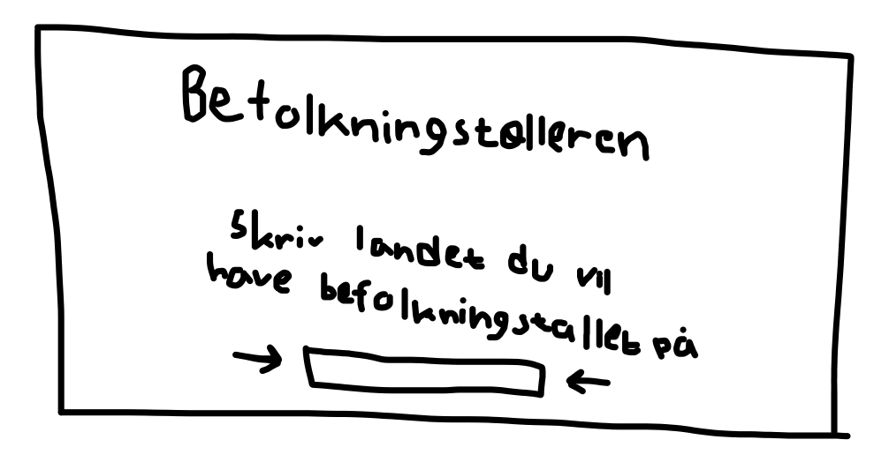
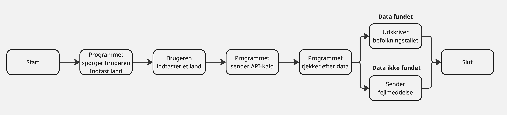

# Synopsis
Dette er årsprøveprojektet i programmering B.
Projektets titel er BefolkningsTælleren.
Udarbejdet af Nuf og Oliver.

## Projektbeskrivelse
Beskrivelse: Vi vil lave et program som skal hjælpe studerende med at undersøge og analysere befolkningstal i lande. Brugeren skal kunne indtaste navnet på et land og få vist befolkningstallet for det pågældende land.

Omfattende beskrivelse af de forskellige funktioner:
Vis befolkningstal for et specifikt land: Brugeren indtaster navnet på et land, og programmet henter og viser data om befolkningstal fra api’en.

Vis samlet befolkningstal for EU: Brugeren indtaster ”EU” for at få vist det samlet befolkningstal af alle lande i EU. 

Vis samlet befolkningstal for hele verden: Brugeren indtaster ”Hele verden” hvorefter programmet skal vise hele verdens befolkningstal samlet.

## Kravspecifikation
|     Titel                 |     Beskrivelse                                                                                                                                                                                                                                                               |     Prioritet       |   |   |
|---------------------------|-------------------------------------------------------------------------------------------------------------------------------------------------------------------------------------------------------------------------------------------------------------------------------|---------------------|---|---|
|     Start menu            |     Menuen skal være minimalistisk og overskuelig. Der skal ikke indgå   ikke for meget indhold i menuen.                                                                                                                                                                          |     nice-to-have    |   |   |
|     Søgnings-bar          |     I søgnings-baren skal det være muligt at skrive et land som man vil kende   indbyggertallet på. Som bonus skal det være muligt at kunne skrive ”EU” og   ”Hele verden” i søgnings-baren hvorefter den skal vise det samlet   befolkningstal for Europa og Hele verden.    |     nice-to-have    |   |   |
|     Menu efter søgning    |     Efter søgningen skal skærmen komme med informationerne på brugerens   søgning.                                                                                                                                                                                            |     nice-to-have    |   |   |
|     Programmet udskriver data    |     Når brugeren har skrevet et land skal programmet udskrive befolkningstallet.                                                                                                                                                                                               |     need-to-have    |   |   |

## Skitser

### Skitse af start menuen:

### Skitse af menuen efter søgning:

## Programbeskrivelse med rutediagrammer

## Rolle-fordeling (arbejdsfordeling)
Vi vil udvikle programmet i fællesskab og sørge for, at opgaverne bliver fordelt så ligeligt som muligt. Det betyder, at vi begge deltager aktivt i hele processen – altså fra ideudvikling og research til selve kodningen og testningen af programmet. 

## Kilder og ressourcer
Vi brugt Miro til rutediagram.
[Link til miro](https://miro.com/)

## Evaluering og vurdering
Vi har udviklet et program, der gør det nemt for brugeren at finde befolkningstal for lande i verden. Programmet opfylder vores need-to-have, men vi havde en større målsetning for programmet som vi desværre ikke fik realiseret. Vi har arbejdet godt sammen om iden, har lige opdelt kodning og test. Alt i alt, er vi kommet i mål med et fint projekt.

