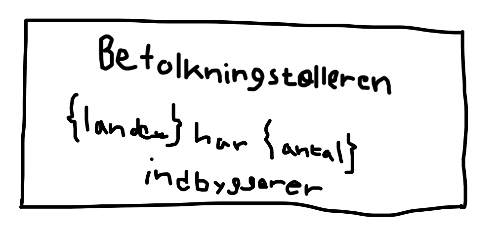

# Synopsis
Dette er årsprøveprojektet i programmering B.
Projektets titel er [BefolkningsTælleren].
Udarbejdet af [Nuf] og [Oliver].

## Projektbeskrivelse
Beskrivelse: Vi vil lave et program som skal hjælpe studerende med at undersøge og analysere befolkningstal i enkelte lande samt kunne vise befolkningstallet for EU og hele verden samlet. Brugeren skal kunne indtaste navnet på et land og få vist befolkningstallet for det pågældende land.

Omfattende beskrivelse af de forskellige funktioner:
Vis befolkningstal for et specifikt land: Brugeren indtaster navnet på et land, og programmet henter og viser data om befolkningstal fra api’en.

Vis samlet befolkningstal for EU: Brugeren indtaster ”EU” for at få vist det samlet befolkningstal af alle lande i EU. 

Vis samlet befolkningstal for hele verden: Brugeren indtaster ”Hele verden” hvorefter programmet skal vise hele verdens befolkningstal samlet.

## Kravspecifikation
|     Titel                 |     Beskrivelse                                                                                                                                                                                                                                                               |     Prioritet       |   |   |
|---------------------------|-------------------------------------------------------------------------------------------------------------------------------------------------------------------------------------------------------------------------------------------------------------------------------|---------------------|---|---|
|     Start menu            |     Menuen skal være minimalistisk og overskuelig. Der skal ikke indgå   for meget indhold i menuen.                                                                                                                                                                          |     need-to-have    |   |   |
|     Søgnings-bar          |     I søgnings-baren skal det være muligt at skrive et land som man vil kende   indbyggertallet på. Som bonus skal det være muligt at kunne skrive ”EU” og   ”Hele verden” i søgnings-baren hvorefter den skal vise det samlet   befolkningstal for Europa og Hele verden.    |     need-to-have    |   |   |
|     Menu efter søgning    |     Efter søgningen skal skærmen komme med informationerne på brugerens   søgning.                                                                                                                                                                                            |     need-to-have    |   |   |

Begrund dine prioriteringer med lidt tekst som forklarer hvorfor de er vigtige.

## Skitser

### Skitse af start menuen:

### Skitse af menuen efter søgning:

## Programbeskrivelse med rutediagrammer
Skriv en kort programbeskrivelse her.

Lav et rutediagram som beskriver hvordan den centrale del af programmet er opbygget.

## Rolle-fordeling (arbejdsfordeling)
Vi vil udvikle programmet i fællesskab og sørge for, at opgaverne bliver fordelt så ligeligt som muligt. Det betyder, at vi begge deltager aktivt i hele processen – altså fra ideudvikling og research til selve kodningen og testningen af programmet. 

## Kilder og ressourcer
Redegørelse for brug af eksterne ressourcer og kilder.

## Brug af AI
Redegørelse for brug af AI.

## Evaluering og vurdering
Sammenfattende konklusion og vurdering.

